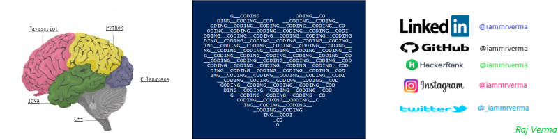

<h1 align="center">Hi 👋, I'm Raj Verma</h1>
<h3 align="center">A greedy and curious learner and programmer.</h3>

- 🌱 I’m currently learning **SQL, DSA**

- 👯 I’m looking to collaborate on [Python](github.com/iammrverma/chess)

- 👨‍💻 All of my projects are available at [iammrverma.github.io](iammrverma.github.io)

- 📝 I regularly write articles on [iammrverma.github.io](iammrverma.github.io)

- 💬 Ask me about **Python, Python pygame,**

- 📫 How to reach me **rajwebz2020@gmail.com**

- 📄 Know about my experiences [iammrverma.github.io/resume](iammrverma.github.io/resume)

- ⚡ Fun fact **Pygame games are not for publishing.**

<h3 align="left">Connect with me:</h3>

<h3 align="left">Languages and Tools:</h3>

      

&nbsp;

